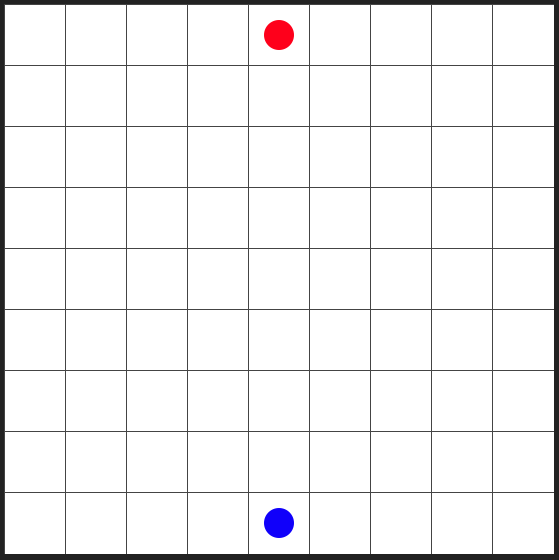

# AI大作业: Quoridor

SJTU-ACM Programming 2017



## 1. 关于游戏

游戏名为Quoridor，中文翻译“步步为盈棋”或“墙棋”。规则如下：

1. 棋盘为9*9的格子

2. 双方轮流行动

3. 行动可选择移动棋子或放置墙壁

4. 每方各有一个棋子，初始时位于本方底线中点

5. 移动棋子可以向棋盘内上下左右任意未被墙遮挡的方向

6. 若即将移动到的未被遮挡的方向上出现对方棋子，则：

   （下述棋子朝向均以我方移动方向为我方朝向，而对方面对我方）

   1. 若移动方向上对方棋子身后没有挡板，则可移动至其后
   2. 若移动方向上对方棋子身后有挡板，则可移动至其左或其右未被遮挡的方向

7. 棋子率先移动到对方底线视为游戏胜利，游戏结束

8. 每方各有10块墙，可放置在格子间隙中

9. 墙必须在两个格子（两个方向共四个格子）当中，包含其夹缝

10. 墙的放置不能重叠

11. 任何时刻的墙放置后都必须保证存在：

    1. 从我方棋子到对方底线任意某点的通路
    2. 从敌方棋子到我放底线任意某点的通路

12. 若双方在100步内未决出胜负，则视为平局（不鼓励平局）。

## 2. 编写说明

修改sample.cpp中三个函数（可以自行添加其他函数）

```c++
void init();
void GetUpdate(std::pair<int, int>);
std::pair<int, int> Action();
```

其中```init()``` 会在程序开始，分配好方向```(ai_side == 0 or ai_side == 1)``` 后执行，可在此处初始化棋盘

```GetUpdate()```会在接收到新的变动后被调用，可用其更新棋盘

```Action()``` 会在要求程序行动时被调用，要返回操作的坐标

对于每一次```GetUpdate()```和```Action()``` 一轮要求时间不超过1秒

## 3. 数据格式

```ai_side``` 的0表示你是棋盘的上边，1表示你是棋盘的下边

在本ai中，所有的操作均由一个数对表示（放墙或者移动棋子）


上图中，四边黑色边框的格为棋子可以落子的格，红色和蓝色分别表示先手和后手的起始位置。

若要移动棋子，则直接输出有效的目的地坐标即可。

​	如红色可输出(4,10)下移一格

​	对于经过对方棋子再走一步的情况也是同样输出目标位置即可

若要增加围墙，如在蓝色面前横向加一道墙：

​	则应输出(17,8)即可将(17,8)(17,9)(17,10)占住或输出(17,10)将(17,10)(17,11)(17,12)占住

若纵向加墙则同理：

​	如输出(14,15)会导致(14,15)(15,15)(16,15)被占据

非法的输出会直接判负。（非法格式、非法坐标、造成封闭、墙数用完还加墙等）

## 4. 提交网站

http://106.15.192.159:3000

如网站无法提交请联系QQ群内助教
